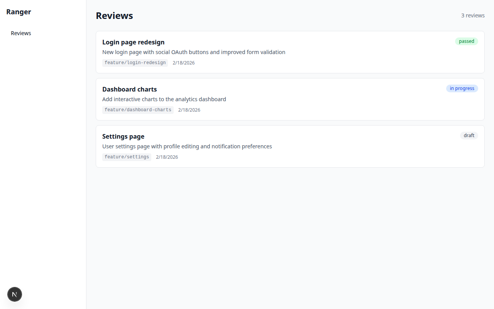
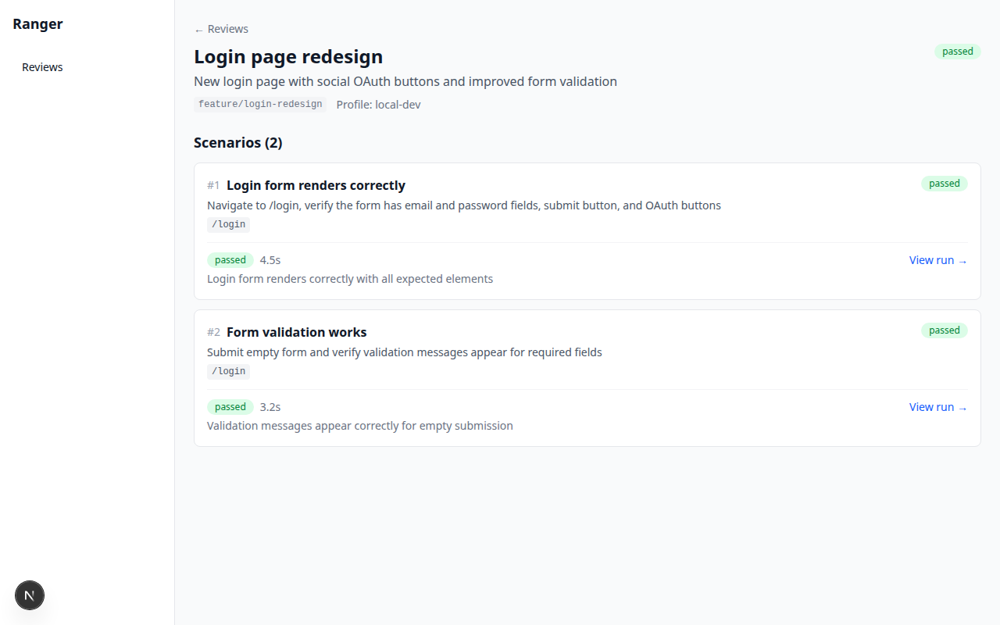
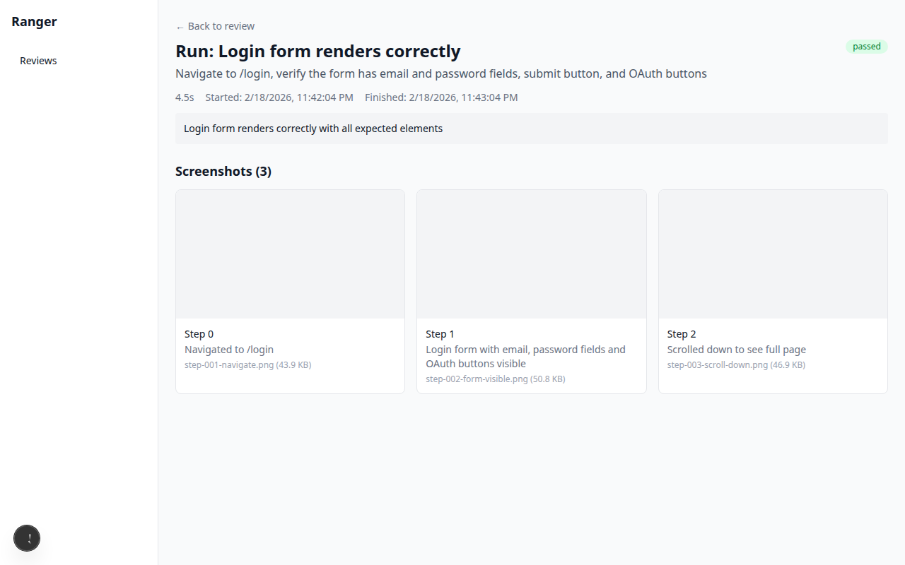

# Ranger

Self-hosted UI feature review automation. Ranger uses a Playwright-powered browser agent to verify UI features against human-written scenarios — then reports verdicts with screenshots in a dashboard.

**The problem:** Coding agents build features but can't visually verify them. You end up alt-tabbing to a browser, clicking around, and eyeballing the result.

**The solution:** Write a scenario like *"Navigate to /login, verify the form has email and password fields and a submit button"*, point Ranger at your dev server, and get back a pass/fail verdict with annotated screenshots — all without leaving your terminal.



## How it works

```
You describe what to verify (scenarios)
  → Ranger launches a browser and navigates your app
  → LLM agent observes screenshots, reasons, and interacts with the page
  → Returns a verdict (passed/failed) with screenshots at each step
  → Results appear in the dashboard and stream to your terminal via SSE
```

With Claude Code hooks installed, the loop tightens further:

```
Claude edits your code
  → PostToolUse hook logs the change (async, non-blocking)
  → Stop hook checks for an active review on your branch
  → Suggests running `ranger go <review-id>` before you context-switch
```

## Quick start

```bash
# Prerequisites: Node.js 20+, pnpm 9+
git clone <repo-url> && cd ranger
pnpm install

# Seed sample data and start the dashboard
pnpm db:seed
pnpm dev
# → http://localhost:4800
```

### Create a review via CLI

```bash
# Point CLI at your server
ranger setup --server-url http://localhost:4800

# Create a browser profile for your dev server
ranger profile add local --base-url http://localhost:3000

# Create a review with scenarios
ranger create --title "Login page" --branch feature/login

# Run verification (screenshot-only mode)
ranger go <review-id>

# Run with LLM agent (requires API key)
ANTHROPIC_API_KEY=sk-... ranger go <review-id>
```

### Create a review via API

```bash
curl -X POST http://localhost:4800/api/reviews \
  -H 'Content-Type: application/json' \
  -d '{
    "title": "Login page redesign",
    "branch": "feature/login",
    "scenarios": [
      {
        "title": "Login form renders correctly",
        "description": "Navigate to /login, verify email and password fields exist",
        "startPath": "/login"
      }
    ]
  }'
```

## Dashboard

The web dashboard at `http://localhost:4800` shows all reviews, scenarios, runs, and screenshot artifacts.

| View | What you see |
|------|-------------|
| **Reviews list** | All reviews with status badges, branch names, descriptions |
| **Review detail** | Scenarios with latest verdict, duration, and summary |
| **Run detail** | Step-by-step screenshots, timing, and verdict reasoning |
| **Live run** | Real-time SSE stream of agent actions as verification runs |





## Architecture

```
packages/
  db/       Drizzle ORM + better-sqlite3 schema, migrations
  web/      Next.js 15 dashboard + API server (port 4800)
  cli/      Commander.js CLI ("ranger" binary)
  agent/    Playwright browser agent (spawned via child_process.fork)
```

**Data flow:**
- CLI talks to the web API over HTTP
- Web API spawns agent workers as child processes
- Agent workers communicate back via Node.js IPC
- Real-time updates stream to the dashboard via SSE

**Database:** SQLite (WAL mode) stored at `~/.ranger/data/ranger.db`. Screenshots saved to `~/.ranger/data/artifacts/<runId>/`.

## Verification modes

### Screenshot-only (no API key)

Navigates to the page, captures screenshots at multiple scroll positions, and returns a `passed` verdict. Useful for visual regression checks where you just want the screenshots.

### LLM agent (with API key)

Runs a ReAct loop: observe the page via screenshot, reason about what to do next, take a browser action, repeat. Supports clicking, typing, scrolling, navigating, and waiting. The agent decides when it has enough evidence to deliver a pass/fail verdict.

```bash
# Anthropic (default)
ANTHROPIC_API_KEY=sk-... ranger go <id>

# OpenAI
OPENAI_API_KEY=sk-... ranger go <id> --llm-provider openai
```

## Claude Code hooks

Ranger includes hooks that integrate with [Claude Code](https://docs.anthropic.com/en/docs/claude-code) to suggest verification after edits.

| Hook | Event | Behavior |
|------|-------|----------|
| `ranger-notify.sh` | PostToolUse (async) | Logs edited file to Ranger API |
| `ranger-suggest.sh` | Stop (sync) | Checks for active review on branch, injects suggestion |

The hooks are registered in `.claude/settings.json` and work automatically when Claude Code is used in this repo. They never block — errors are silently swallowed.

## CLI reference

```
ranger setup [--server-url <url>]     Configure server connection
ranger profile add <name> --base-url  Create a browser profile
ranger profile list                   List profiles
ranger create --title <t>             Create a review
ranger list [--status <s>]            List reviews
ranger show <id>                      Show review details
ranger go <id> [--api-key <key>]      Run verification
ranger hook notify                    Log hook event (stdin)
ranger hook suggest                   Check branch for review (stdin)
```

## API endpoints

| Method | Path | Description |
|--------|------|-------------|
| GET | `/api/status` | Health check |
| GET | `/api/reviews` | List reviews (`?status=`, `?branch=`) |
| POST | `/api/reviews` | Create review with scenarios |
| GET | `/api/reviews/:id` | Review detail with scenarios and runs |
| POST | `/api/verify` | Trigger verification |
| GET | `/api/verify/:runId` | Poll run status |
| GET | `/api/verify/:runId/stream` | SSE stream of run events |
| POST | `/api/hooks/notify` | Log hook event |
| POST | `/api/hooks/suggest` | Check branch for active review |
| GET | `/api/profiles` | List profiles |
| POST | `/api/profiles` | Create profile |

## Development

```bash
pnpm install        # Install dependencies
pnpm dev            # Start dev server on :4800
pnpm build          # Build all packages
pnpm typecheck      # Type-check all packages
pnpm test           # Run tests (vitest)
pnpm db:seed        # Seed sample data
```

## Tech stack

- **TypeScript** (strict mode) across all packages
- **Next.js 15** App Router + Tailwind CSS v4
- **SQLite** via better-sqlite3 + Drizzle ORM
- **Playwright** for browser automation
- **Commander.js** for the CLI
- **Vitest** for testing

## License

MIT
